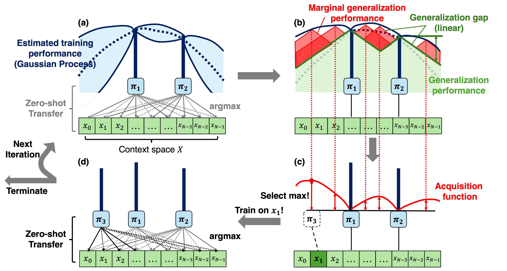
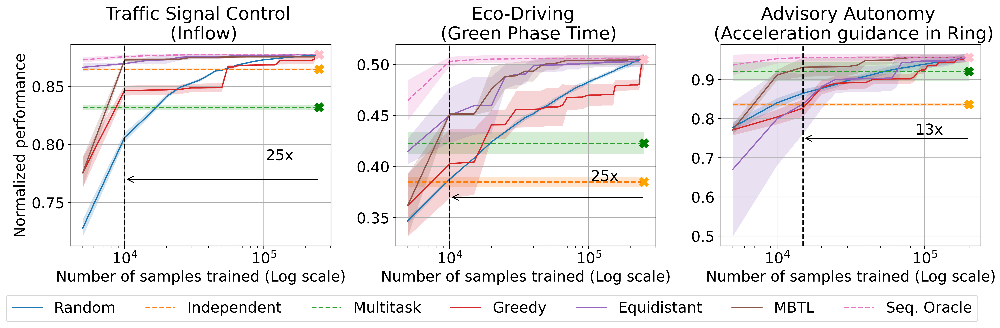
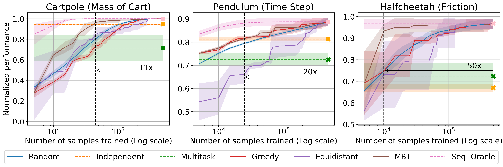

# Model-Based Transfer Learning for Contextual Reinforcement Learning

Codebase for "Model-Based Transfer Learning for Contextual Reinforcement Learning (NeurIPS 2024)"

[Project Website](https://jhoon-cho.github.io/MBTL/), [Paper (Arxiv)](https://arxiv.org/abs/2408.04498)



## Directory

```
MBTL/
├── MBTL/
│   ├── collect_result.py       # Script to collect and process results of MBTL algorithms and baselines
│   └── utils.py                # Utility functions for analysis
├── advisory-autonomy/
│   ├── pexps/                  # Code for experiments
│   ├── u/                      # Utils
│   └── s-*.sh                  # job script file
├── eco-driving/
│   ├── code/                   # Code for experiments
│   ├── datasets/               # Datasets for the eco-driving task
│   ├── misc/                   # Miscellaneous files
│       └── idm_calibrations/   # Calibrations for the Intelligent Driver Model
│   ├── requirements.txt.       # Python requirements file
│   └── s-*.sh                  # job script file
├── traffic-signal/
│   ├── network/                # Code related to traffic network
│   ├── settings/               # Settings and configurations
│   ├── environment.yml         # Environment file for managing dependencies
│   ├── generator.py            # Script for generating traffic scenarios
│   ├── model.py                # Code for the RL algorithm
│   ├── testing_main.py         # Main script for testing
│   ├── testing_simulation.py   # Simulation code for testing
│   ├── training_main.py        # Main script for training
│   ├── training_simulation.py  # Simulation code for training
│   ├── transfer_main.py        # Main script for transfer learning
│   ├── transfer_simulation.py  # Simulation code for transfer learning
│   ├── utils.py                # Utility functions
│   └── script-*.sh             # job script file
├── control-tasks/
    ├── carl/                   # Code for CARL
    └── s-*.sh                  # job script file
```
## Installation - MBTL
```
cd MBTL/
conda env create -f environment.yml
```

## Installation - Traffic Benchmarks

### Advisory autonomy
```
cd advisory-autonomy/
python setup.py
```
### Traffic signal control
```
cd traffic-signal/
conda env create -f environment.yml
```
### Eco-driving control
```
cd eco-driving/
pip install -r requirements.txt
```

## Installation - Standard control benchmarks

### CARL
```
cd {tasks}/
conda env create -f environment.yml
```

## Run MBTL and baselines
### Naming convention for domains

```
data_name ={domain name}_{context variation}_{trial number}
```

For instance, `cartpole_masscart_0`, `cartpole_masscart_1`, `cartpole_masscart_2` are three different trials for the `cartpole` (CartPole) domain with the `masscart` (Mass of the cart) context variation.

### Run MBTL and sequential baseline
```
cd MBTL/
python collect_result.py
```

- `MBTL`: Run MBTL algorithm
- `greedy_temporal_transfer_learning`: Run greedy baseline
- `coarse_to_fine_transfer_learning`: Run equidistant baseline
- Independent training: Take diagonal of the transfer matrix
- Multitask baseline: Should be placed in the `MBTL/` directory

## Results
### Traffic tasks

### Control tasks



## Cite
```
@inproceedings{cho2024model,
        title={Model-Based Transfer Learning for Contextual Reinforcement Learning},
        author={Cho, Jung-Hoon and Jayawardana, Vindula and Li, Sirui and Wu, Cathy},
        booktitle={Thirty-Eighth Conference on Neural Information Processing Systems},
        year={2024}
```